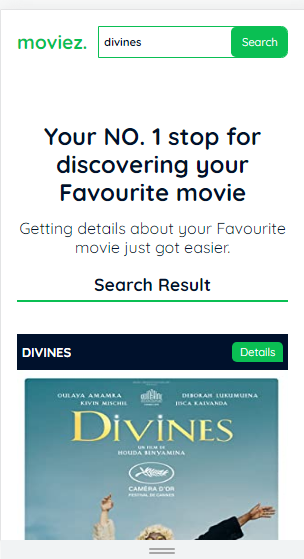

# Table of contents

- [Overview](#overview)
  - [About movies web app](#about-moviez-web-app)
  - [Screenshot](#screenshot)
  - [Link](#link)
- [My process](#my-process)
  - [Built with](#built-with)
- [Useful Resources](#useful-resources)
- [Author](#author)

## Overview 

### About moviez web app

moviez is a web application where users can easily search for their favourite movies and get details about them.

Users are able to:

- Search for movies using the search bar at the top of the page
- See the results of their search result displayed as
    - the movie title
    - movie poster
    - and a details button which they can easily expand or collapse to see links to details about the movie

### Screenshot

### Link

- [Live Site](https://uzoway.github.io/movie-search-app/)

## My Process

### Built with

- Semantic HTML5 markup
- CSS3
- vanilla JavaScript
- OMDB API
- Mobile-first design approach

## Useful Resources

- [OMDB API](http://www.omdbapi.com/)

## Author 

- LinkedIn - [Uzochukwu Victor Okafor](https://www.linkedin.com/in/uzochukwuokafor/)

